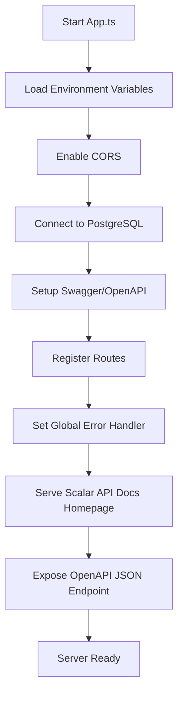
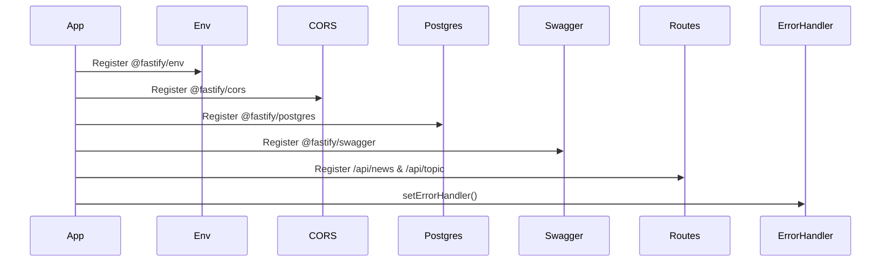
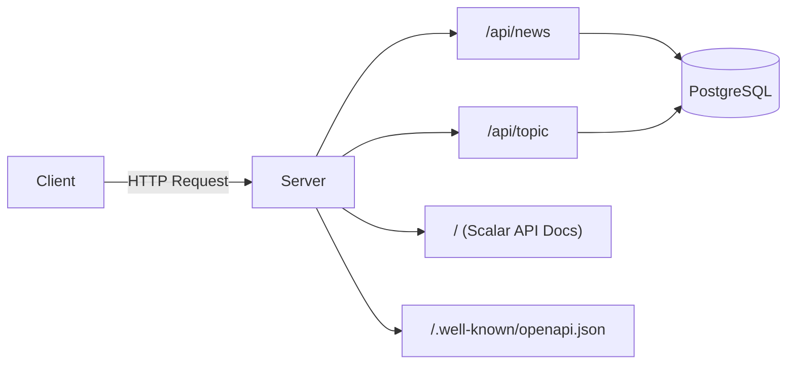
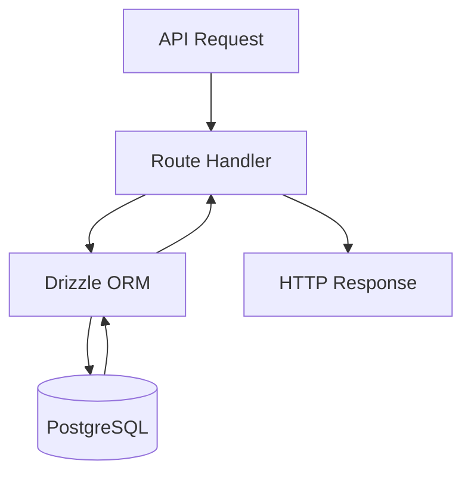
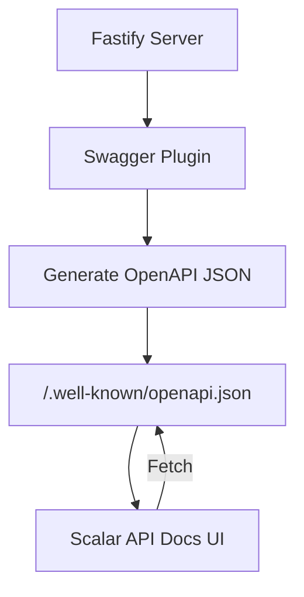
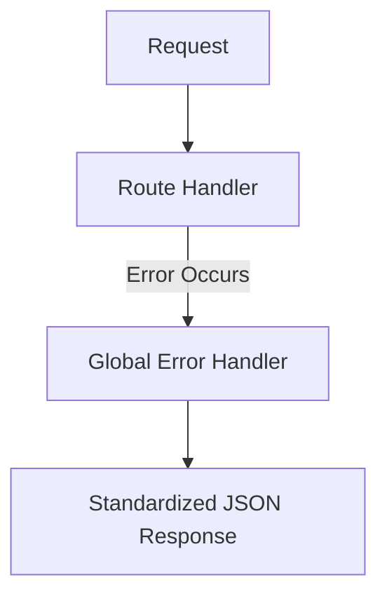
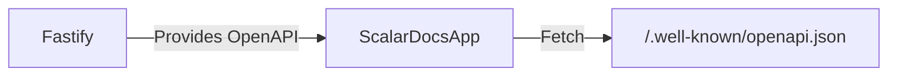
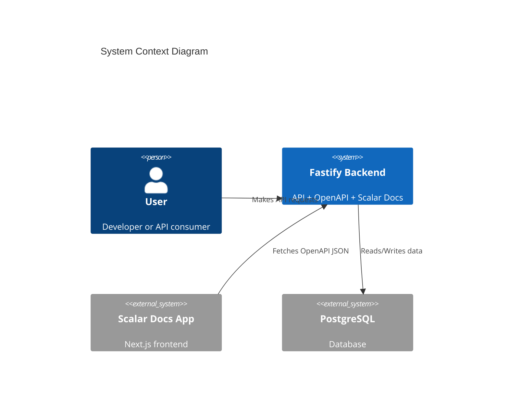
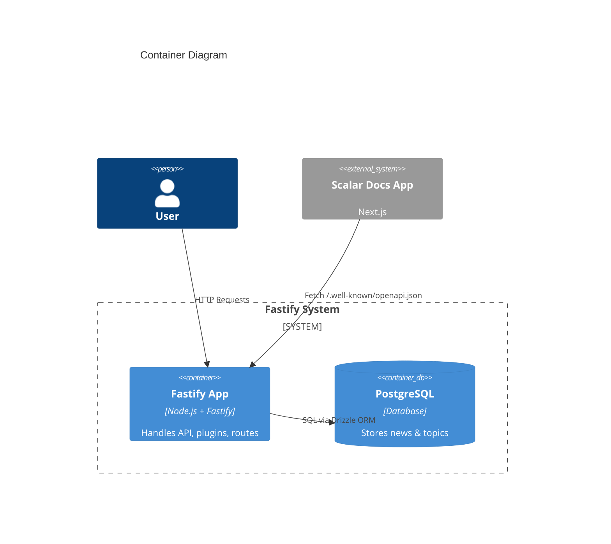
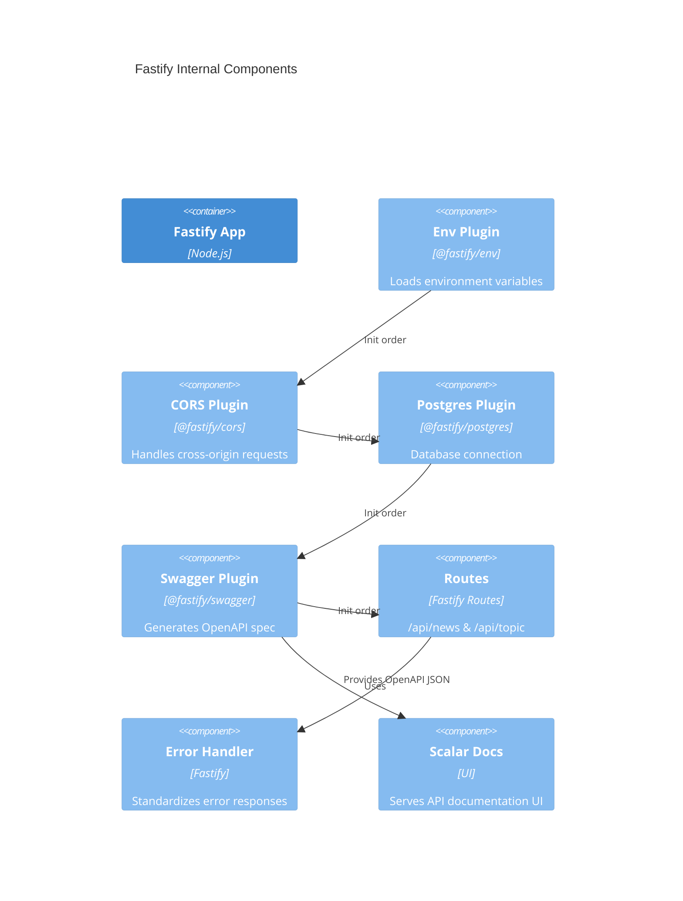

# Fastify System Design

This document describes the system design of the Fastify application using **Mermaid diagrams**.

---

## 🧭 Entry Point Overview

The main entry of the application is located at:

```
/apps/fastify/src/App.ts
```

This file is responsible for:
- Initializing Fastify
- Registering plugins
- Registering routes
- Starting the server

---

## ⚙️ Application Initialization Flow



---

## 🔌 Plugin Registration Order

The order of plugin registration is important in Fastify.



---

## 🌐 Routing Structure



---

## 🗄️ Database Interaction



---

## 📖 API Documentation Flow



---

## 🧱 Error Handling Flow



---

## 🧩 Key Notes

- All plugins are registered before the server starts listening
- OpenAPI JSON is exposed for external consumers (e.g. API docs app)
- Scalar API docs are served directly from the Fastify root (`/`)
- Database access is handled via Drizzle ORM
- Global error handler ensures consistent API responses

---

## 🔗 External Integration



- `/apps/scalar-api-docs` consumes the OpenAPI spec from Fastify
- Default URL: http://localhost:4000/.well-known/openapi.json

---

## 🧱 C4 Model (High-Level Architecture)

### Level 1: System Context



---

### Level 2: Container Diagram



---

### Level 3: Component Diagram (Fastify App)



---

## ✅ Summary

The Fastify app acts as:
- Backend API server
- OpenAPI provider
- API documentation server (Scalar UI)

All responsibilities are centralized but cleanly separated via plugins and routes.

