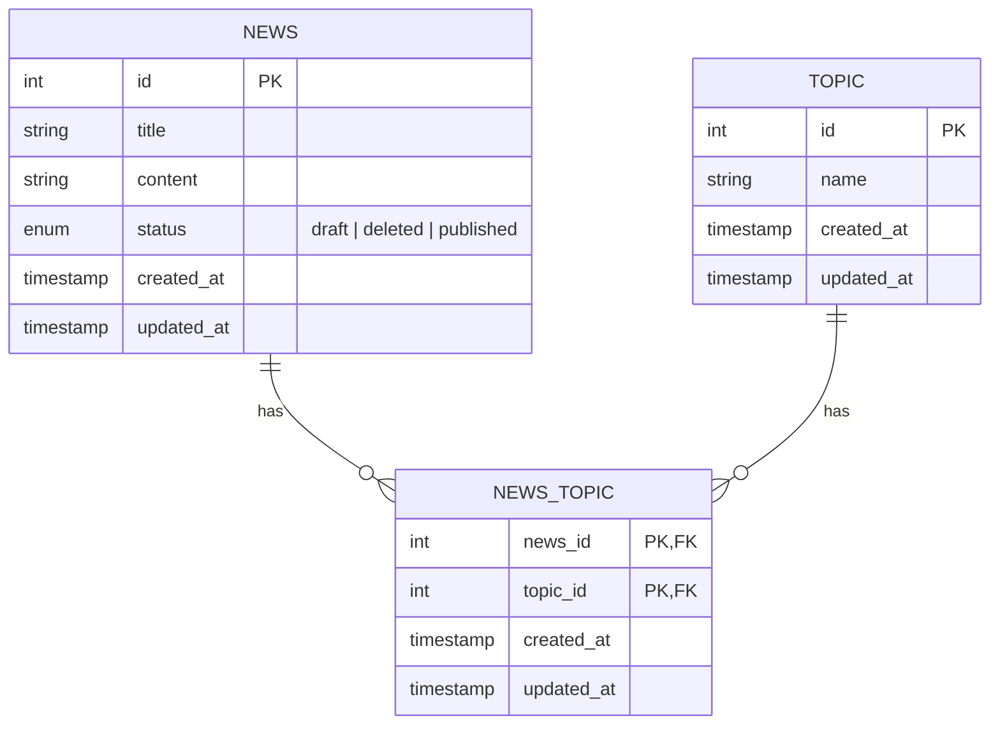

# @modules/model-type

This package contains shared **TypeScript interfaces** that represent the data models used across the monorepo.

Although this module only provides type definitions, it reflects the actual **database structure** used in the backend.

---

## 🧱 Data Model Overview

The system consists of three main entities:

* **News**
* **Topic**
* **NewsTopic** (junction table)

---

## 📊 Entity Relationship Diagram (ERD)

---

## 🔗 Relationships

* A **News** can have multiple **Topics**
* A **Topic** can belong to multiple **News**
* This many-to-many relationship is handled by the **NewsTopic** table

---

## 🗄️ Table Details

### News

| Field      | Type   | Description                 |
| ---------- | ------ | --------------------------- |
| id         | number | Primary key                 |
| title      | string | News title                  |
| content    | string | News content                |
| status     | enum   | draft | deleted | published |
| created_at | string | Timestamp                   |
| updated_at | string | Timestamp                   |

---

### Topic

| Field      | Type   | Description |
| ---------- | ------ | ----------- |
| id         | number | Primary key |
| name       | string | Topic name  |
| created_at | string | Timestamp   |
| updated_at | string | Timestamp   |

---

### NewsTopic (Junction Table)

| Field      | Type   | Description   |
| ---------- | ------ | ------------- |
| news_id    | number | FK → News.id  |
| topic_id   | number | FK → Topic.id |
| created_at | string | Timestamp   |
| updated_at | string | Timestamp   |

* Uses a **composite primary key**: `(news_id, topic_id)`
* Ensures no duplicate relationships between the same news and topic

---

## 🧩 Purpose

This module exists to:

* Share consistent data types across apps
* Represent database structure in TypeScript
* Improve type safety between backend and frontend

---

## 📄 License

MIT
